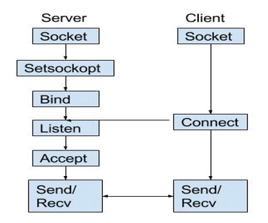

### Socket programming 

##### Socket system calls

- TCP Server
    - socket : create new socket (returns socket file descriptor)
    - bind : bind server socket to well-known port number and IP address
    - listen : start listening for new connections on server socket
    - accept : accept a new connection on server socket (returns a new socket to talk to this specific client)
    - read : read data from client into memory buffer
    - write : write data from memory buffer into socket connected to client

- TCP Client
    - socket : create new socket (returns socket file descriptor)
    - Binding client socket to IP/port is optional
    - connect : connects to a server socket using the server's IP address and port number (initiates TCP 3 way handshake to server)
    - read : read data from a connected socket into a memory buffer
    - write : write data from a memory buffer into socket

- multi process / threaded design is good approach for multiple client server
- One process / thread dedicated to a client, blocking system calls for network I/O
- event driven I/O : single server process / thread can simultaneously perform I/O from multiple sockets
    - Examples: select, epoll

- Types of sockets
    - Unix domain (local) socket
    - Internet sockets (IP address + port number)
    
    - Connection-based sockets (TCP) - stream sockets
    - Connection-less sockets (UDP) - datagram sockets

https://www.tutorialspoint.com/cplusplus/cpp_socket_programming.htm