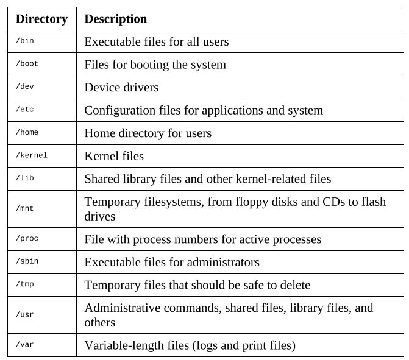

### Chapter 1

- What is system applications ?
    - Software that is used by other software, not directly by the final user.
    - The software is hardware aware and oriented toward performance.
- APIs are series subroutine definitions, communication protocols, and tools for building software.
- Types of APIs
    - Operating systems
    - Libraries and frameworks
    - Remote APIs
    - Web APIs (REST APIs, SOAP APIs)
- Protection Ring
- Kernal space and user space
    - Applicat at user space (level 3) & OS and kernel task at kernel space - more privilege
- System calls are the way operating systems provide access to the resources for the applications.
- OS system calls category
    - File management
    - Device management
    - Information maintenance
    - Communication
- POSIX standards
    - Portable Operating System Interface
    - POSIX.1 - core services
        - Process creation and control
        - Signals
        - File and directory operations
        - Pipes
        - C library
        - I/O port interface and control
        - Process triggers
    - POSIX.1b and POSIX.1c - realtime and thread extensions
        - Priority scheduling, Real-time signals, Clocks and timers, Semaphores, Message passing, Shared memory, Async / sync I/O, Memory locking interface
        - Thread creation, control and cleanup
        - Thread scheduling
        - Thread synchronization
        - Signal handling
    - POSIX.2 - shell and utilities - command line

### Chapter 2
- Unix OS components - Memory management, Files and filesystems, Processes, Users, groups and permissions, Process communications
- Memory management
    - Single allocation (MS-DOS)
    - Partitioned allocation
    - Paged Memory
        - frames, pages and pagination
        - Virtual memory - swapping
        - swap in and swap out process
        - top command with RES, VIRT, SHR
- File and filesystems
    - A filesystem is a method used to structure data in a disk, and a file is the abstraction used for indicating a piece of self-contained information. 
    - Linux filesystem (FS)
        - EXT - extended filesystem
        - FAT - File allocation table
        - NTFS - New Technology File System
    - Files and hard and soft links
        - File is a some content with meta data.
        - Hard link : when more than one file points to the same content its hardlink
        - Soft link : its file that points to the another soft link or hard link.
        - Symbolic link : its regular file with its own data that is the path to another file.
    - In Unix some resources that are not part actually files are represented as files, and communication with these resources is archieved by writing to or reading from their correspoinding files.
    - /dev/sda - its entire disk
    - /dev/stdout, /dev/stdin, /dev/stderr - respectively
    - inode - data structure to store all the information of file except its name and its actual data.
    - Directory structure

    

    - The operating system splits the hard drive into logical units called partitions, and each one can be a different file system.
    - /etc/fstab or mtab for mount path reference

- Processes
    - processId - unique five digit id for identifying running process uniqly
    - ppid - parent process id
    - Nice number - degree of friedliness of this process towards the other processes.
    - Terminal or TTY - terminal to which this process is connected
    - ps -f - to see all running processes
    - process life cycle
        - fork - copy of running process with its own space
        - exec - replace current process with new process (process should have its own entry point from where it will start)
    - process has two modes
        - foreground - within opened terminal
        - background - with & symbol
            - to list background process - jobs command is used
    - killing process can be done in different ways with commands as SIGINT, SIGKILL and SIGTERM

- Users, groups and permissions
    - this are main entities that are used in linux to control access to resources.