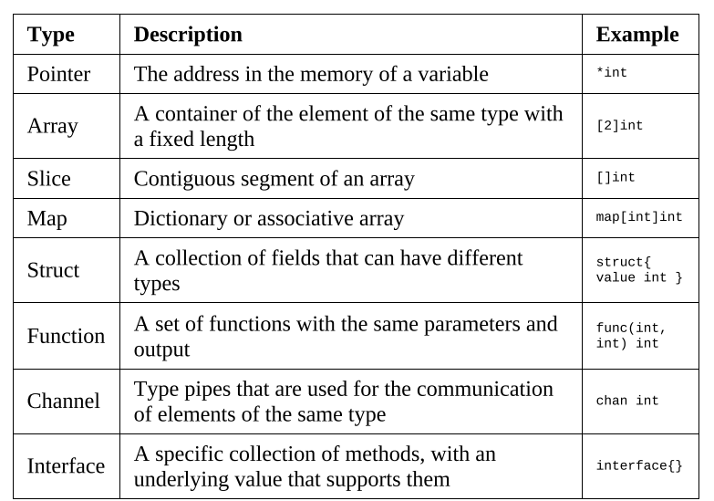

### Chapter 1

- What is system applications ?
    - Software that is used by other software, not directly by the final user.
    - The software is hardware aware and oriented toward performance.
- APIs are series subroutine definitions, communication protocols, and tools for building software.
- Types of APIs
    - Operating systems
    - Libraries and frameworks
    - Remote APIs
    - Web APIs (REST APIs, SOAP APIs)
- Protection Ring
- Kernal space and user space
    - Applicat at user space (level 3) & OS and kernel task at kernel space - more privilege
- System calls are the way operating systems provide access to the resources for the applications.
- OS system calls category
    - File management
    - Device management
    - Information maintenance
    - Communication
- POSIX standards
    - Portable Operating System Interface
    - POSIX.1 - core services
        - Process creation and control
        - Signals
        - File and directory operations
        - Pipes
        - C library
        - I/O port interface and control
        - Process triggers
    - POSIX.1b and POSIX.1c - realtime and thread extensions
        - Priority scheduling, Real-time signals, Clocks and timers, Semaphores, Message passing, Shared memory, Async / sync I/O, Memory locking interface
        - Thread creation, control and cleanup
        - Thread scheduling
        - Thread synchronization
        - Signal handling
    - POSIX.2 - shell and utilities - command line

### Chapter 2
- Unix OS components - Memory management, Files and filesystems, Processes, Users, groups and permissions, Process communications
- Memory management
    - Single allocation (MS-DOS)
    - Partitioned allocation
    - Paged Memory
        - frames, pages and pagination
        - Virtual memory - swapping
        - swap in and swap out process
        - top command with RES, VIRT, SHR
- File and filesystems
    - A filesystem is a method used to structure data in a disk, and a file is the abstraction used for indicating a piece of self-contained information. 
    - Linux filesystem (FS)
        - EXT - extended filesystem
        - FAT - File allocation table
        - NTFS - New Technology File System
    - Files and hard and soft links
        - File is a some content with meta data.
        - Hard link : when more than one file points to the same content its hardlink
        - Soft link : its file that points to the another soft link or hard link.
        - Symbolic link : its regular file with its own data that is the path to another file.
    - In Unix some resources that are not part actually files are represented as files, and communication with these resources is archieved by writing to or reading from their correspoinding files.
    - /dev/sda - its entire disk
    - /dev/stdout, /dev/stdin, /dev/stderr - respectively
    - inode - data structure to store all the information of file except its name and its actual data.
    - Directory structure

    

    - The operating system splits the hard drive into logical units called partitions, and each one can be a different file system.
    - /etc/fstab or mtab for mount path reference

- Processes
    - processId - unique five digit id for identifying running process uniqly
    - ppid - parent process id
    - Nice number - degree of friedliness of this process towards the other processes.
    - Terminal or TTY - terminal to which this process is connected
    - ps -f - to see all running processes
    - process life cycle
        - fork - copy of running process with its own space
        - exec - replace current process with new process (process should have its own entry point from where it will start)
    - process has two modes
        - foreground - within opened terminal
        - background - with & symbol
            - to list background process - jobs command is used
    - killing process can be done in different ways with commands as SIGINT, SIGKILL and SIGTERM

- Users, groups and permissions
    - this are main entities that are used in linux to control access to resources.
    - Authorization to file and other resources are provided by users and groups.
    - User Id (UID) and Group Id (GID)
    - /etc/passwd - file contains all information on user and its meta data
    - Read, Write and Execute permissions
    - Permissions are categorise as owner, group and other.
    - chmod command used for changing permission on file or directory.

- Process communications
    - The OS is responsible for communication between processes and has different mechanisms to exchange information.
    - These processes are
        - unidirectional - exit codes, signals, pipes
        - bidirectional - sockets
    - Exit codes
        - The exit code of the last command is stored in the $? variable, and it can be tested in order to control the flow of the operations.
    - Signals
        - signals make it possible to interface any process with another, including itself.
        - kill -l - command used for listing the signals
    - Pipes
        - Pipes connects two ends - a process input with another process output.
        - |, >, <, >> 
    - Sockets
        - Unix domain sockets are a bidirectional communication method between applications on the same machine.
        - sockets are classified as:
            - SOCK_STREAM
            - SOCK_SEQPACKET
            - SOCK_DGRAM

- Summary
    - Memory management - pagination and swap
    - File management - files, directories, hard link, soft links
    - mount, unmount
    - process life cycle, exec, fork and kill etc
    - users, groups and permissions etc
    - process communication - uni directional, bi directional

### Chapter 3 An Overview of Go

- Namespace
    - pkg, src, bin directories
    - Each file starts with a package definition, that is package package_name.
    - normal import, named imports, 
- Type system
    - The Go type system defines a series of basic types, including bytes, strings and buffers, composite types like slices or maps, and custom types that have been defined by the application.
- Go basic types

- Composite types

- custom defined types can be defined using type define definition
- The main uses of custom types are to define methods and to make the type specific for a scope, like defining a string type called Message.
- built in functions like make and new are used for allocation.
- almost all operators available in the Go lang which are supported by other general purpose languages
- Scope
    - package, function or control scope.
- Constants - Go doesn't have immutability for its variables but defines another type of immutable value called constant. 
- Flow control
    - sequential - if/else, switch and for
    - concurrent - go, select
- Defer : used for closing resource at the end of execution for current context
- Panic : In Go language, panic is just like an exception, it also arises at runtime. Or in other words, panic means an unexpected condition arises in your Go program due to which the execution of your program is terminated.

- Concurrency model 
    - Concurrency is so central to Go that two of its fundamental tools are just keywords - chan and go.
    - Go channels
        - A channel is made for sharing data, and it usually connects two or more execution threads in an application, which makes it possible to send and receive data without worrying about data safety. Go has a lightweight implementation of a thread that is managed by the runtime instead of the operating system, and the best way to make them communicate is through the use of channels.
    - Creating a new goroutine is pretty easy - you just need to use the go operator, followed by a function execution. This includes method calls and closures.
- Memory management
    - stack and heap
    - function calls in stack, go routines in heap
    - The GC - Garbage collector is responsible for clean up the unreferenced values in the heap, so avoiding storing data in it is a good way of lowering the work of the garbage collector (GC)

- Build and compiling programs
    - go version
    - go env
    - go build
    - go run
    - go.mod or go.sum file used for dependency management etc
    - go mod tidy - clean up dependencies
    - go get - to get the pkg

- File create, truncate, file system events - multiple features supported by Go lang & its community pkgs.